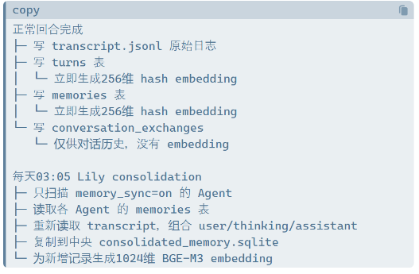

# HASHI Persona-Context-Memory (PCM) System Design

*Architecture, current implementation, target design and known issues*

| **Document information** | **Value** |
| ------------------------ | --------- |
| Purpose | Define how HASHI maintains and distributes Persona, Context, and Memory to Engine (Harness) Providers while distinguishing current implementation, target design, and known gaps. |
| Status | Authoritative PCM module specification under the [HASHI System Architecture](../ARCHITECTURE.md). |
| Revision | 1 September 2026 — aligned PCM with PAO ownership, fixed HER Engine Sessions, incremental PCM, and canonical HER recovery. |

## 1. Overview

PCM is one of HASHI's four functional modules, alongside PAO, HER v2, and
Frontend Connectors. It owns the definition, authority order, retrieval,
assembly, versioning, and typed projection of Persona, Context, and Memory.

PAO owns Agent and Conversation Session control and selects an Engine Provider.
PCM supplies that Engine with a full authoritative projection at the required
bootstrap or rebase boundary and with typed deltas thereafter when the Engine
contract supports them. HER v2 consumes PCM inside its HER Engine Session but
does not become PCM authority.

PCM is held primarily in `agent.md` and is supplemented by runtime Context,
recent Conversation Session history, memory services, and authorised Skills
and Tools metadata. PCM describes capability; it does not grant permission or
execute a Tool.

## 2. agent.md

The file agent.md, written in lower case, is the default container for an agent’s persistent PCM configuration. Earlier versions allowed agent.md, AGENT.md or other names. From the release of this specification, the required file name is agent.md.

## 3. Persona

An agent’s persona is defined in a lower-case \[persona\] block in agent.md:

```text
[persona]
You are a helpful assistant named Lily.
[persona_end]
```

A persona should normally describe the agent’s name, role, tone, preferred form of address, default language and optional emoji use.

A PCM-compatible Engine may extract this block when it only needs Persona
information for message rendering or delivery. The Persona block supports
Persona-aware rendering before delivery. Telegram and Backend API Connectors do
not interpret the Persona themselves.

## 4. Context

Context is information that is neither persona nor memory but is still important to effective agent operation. HASHI may add the following context to an assembled request.

### 4.1 System prompts

System prompts have two layers.

#### Permanent system prompt

The permanent system prompt is stored in agent.md. This block is a new standard introduced by this specification:

```text
[sys]
Permanent system instructions.
[sys_end]
```

Content inside this block is treated as a system prompt by HER v2 and other
compatible Engines. It can only be changed by editing `agent.md` directly.

#### Dynamic system prompts

Dynamic system prompts are temporary or quickly configurable instructions managed through /sys. They are stored in JSON and remain after restart or /reset until they are manually disabled or deleted.

| **Scope**            | **Behaviour**                                                                                                                                                                                                                                                                                                                                                                       |
| -------------------- | ----------------------------------------------------------------------------------------------------------------------------------------------------------------------------------------------------------------------------------------------------------------------------------------------------------------------------------------------------------------------------------- |
| Agent-local /sys     | Each agent has ten local slots. They are stored in sys\_prompts.json in that agent’s workspace and affect only that agent. Saving a prompt does not enable it; the user must turn it on. Off disables the prompt without deleting it. Delete removes its content.                                                                                                                   |
| Instance-global /sys | Each HASHI instance has ten global slots, accessed through /sys global or /sys g. All configured Bridge Agents in the instance read active global prompts on their next request. Global prompts are not copied into agent workspaces. Global prompts precede and override conflicting local /sys prompts, but cannot override higher-level system permissions or safety boundaries. |

### 4.2 Working environment

#### Workspace

Each HASHI agent has a native workspace configured during setup. By default, the agent may read from and write to that workspace. For example:

`<HASHI_ROOT>/workspaces/<agent_name>`

#### Workzones

Workzones give an Agent access to, and focus on, one or more project folders.
PAO's HASHI Conversation Session owns ten independent slots: `main` plus `1`
through `9`. PCM projects the enabled, validated slots into Context but does
not own or mutate their state. `/workzone` without a number addresses `main`;
`/workzone 1` through `/workzone 9` address attached roots.

  - An enabled `main` slot becomes the effective working directory and first inspection location.

  - Enabled numbered slots are attached task roots. They do not change the effective working directory.

  - Each slot may be enabled, disabled, replaced, reloaded or deleted independently. Reload revalidates and rebinds the saved directory; it does not clear it. Delete removes only the slot configuration and never deletes filesystem content.

  - Active available directories may be passed to native CLI Engines through repeated `--add-dir` or `--include-directories` arguments, according to Engine support.

  - The HASHI Tool Registry receives the exact active roots. Multiple roots are not widened to their common parent.

  - Slot mutations carry an internal Session revision so stale inline menus and delayed path replies cannot overwrite newer state. This revision is control metadata and is not rendered as user-facing menu or PCM text.

|                                                                                                                                                                                                                                                                                                                                                                                                                                 |
| ------------------------------------------------------------------------------------------------------------------------------------------------------------------------------------------------------------------------------------------------------------------------------------------------------------------------------------------------------------------------------------------------------------------------------- |
| **Important** Workzone is primarily a focus and default execution location mechanism, not a security boundary by itself. Access restrictions are enforced jointly by the active Engine Provider and HASHI. Native Engine sandboxes and permission modes remain applicable, while the PAO-owned HASHI Tool Registry and Tool Gateway enforce configured Tool permissions, exact `access_roots` and other admission controls. Workzone does not override or weaken any of these controls. |

When at least one slot is enabled, HASHI emits one protected `working_environment.workzones` runtime-context section. It lists only enabled slots, marks `main` as primary and numbered slots as attached, and treats every path and label as data rather than instructions. Disabled slots are retained in Session state but omitted from PCM.

When all Workzones are off, PCM does not generate a WORKZONES Context section.
PAO restores the Engine and Tool Registry working directory to the Agent home
workspace and uses its normal default access root. The Agent home workspace is
therefore a normal task folder when no Workzone is active; the instruction to
reserve it for memory, identity, logs and workspace-state work applies only
while one or more Workzones are active.

#### High-permission or “YOLO” mode

HASHI does not currently provide a single cross-Engine YOLO switch or a shared
`yolo_mode` state. High-permission operation depends on the Engine Provider and
is a security permission strategy rather than a PCM working-environment
feature.

When an Engine is configured for high-permission operation, an Agent may be
able to navigate outside its workspace and Workzone, including across the
computer and internet. This creates inherent risk. Native CLI permissions
remain Engine-owned. For HASHI-provided Tools, PAO also enforces the configured
Tool Registry, Tool Gateway, `access_root`, and request-admission controls;
these controls are separate from Workzone.

| **Engine Provider**  | **Current mechanism**                                                                       |
| ------------ | ------------------------------------------------------------------------------------------- |
| Gemini CLI   | \--approval-mode yolo                                                                       |
| Codex CLI    | \--dangerously-bypass-approvals-and-sandbox                                                 |
| Claude CLI   | \--dangerously-skip-permissions                                                             |
| Grok CLI     | Uses bypassPermissions and --always-approve by default, subject to configuration            |
| HER-V2       | Uses its own Tool Gateway, tool permissions and permission\_mode                            |
| API Engine adapters | Depend on PAO-provided Tool catalogues and permissions; there is no common YOLO parameter |

### 4.3 Time information

HASHI injects accurate time information into the top-level request assembled for each external user turn. This gives the model a reliable sense of time and supports time-based questions. It does not automatically inject time into every internal HER-V2 Planning, Execution, Review or Finalisation model call.

The current projection includes local date, seconds, named time zone, UTC
offset, and relevant previous-message timing.

### 4.4 Skills catalogue

HASHI has a standard Skills system. PCM may include a concise catalogue
containing only names and metadata after PAO has filtered availability for the
current Agent, Run, stage, Workzone, and permission scope. The catalogue
describes what is available; it does not grant capability and does not include
full Skill instructions unless a selected Skill contract requires them.

### 4.5 Tools catalogue

HASHI has a standard Tool package. PCM may include a concise catalogue when
PAO permits Tool use. PAO owns registry, permission, invocation, and execution
authority; an Engine owns only its internal decision to request an available
Tool and its Engine-level evidence. Catalogue metadata never grants access.

| **Catalogue**    | **Current implementation status**                                                              | **Target treatment**                                                         |
| ---------------- | ---------------------------------------------------------------------------------------------- | ---------------------------------------------------------------------------- |
| Skills catalogue | Partly available through the HER v2 Direct route; not supplied to every Engine on every turn. | Expose a concise HASHI-level catalogue to all permitted Agents and Engines. |
| Tools catalogue  | Provided to HER v2 by phase rather than as a uniform concise catalogue.                      | Expose a concise HASHI-level catalogue to all permitted Agents and Engines. |

### 4.6 Cross-session context

PAO allows an Agent to switch between permitted Engine Providers. When binding
to a fixed Engine, the user may choose whether PCM sends cross-Session Context.
This Context consists of the last ten completed user-assistant exchanges and is
sent at the applicable bootstrap boundary rather than repeatedly as flat
history. A fixed Engine such as HER v2 thereafter receives authoritative PCM
deltas while preserving its Engine Session.

Flex Engine invocations do not receive a separate cross-Session package because
PCM already injects the applicable previous exchanges on each external user
turn.

Recent-history and handoff payloads are bounded. Non-HER Engines use
Engine-specific assembled-request budgets, while the current handoff builder
also applies a limit of approximately 6,000 words. When a limit requires
reducing conversation history, PCM must remove the **oldest complete chat
entries first**. It must preserve the newest chats ahead of older chats and
must not discard the current user request or higher-authority PCM sections to
retain older history. HER v2 continues to use its own context-capacity and
Compact controls.

|                                                                                                                                                                                          |
| ---------------------------------------------------------------------------------------------------------------------------------------------------------------------------------------- |
| **Known issue** The current `/backend +` process rebuilds a handoff file and sets a one-time prompt, but may not send the handoff content to the selected Engine. This remains to be resolved. |

## 5. Memories

### 5.1 Raw agent memory

HASHI retains complete user-model activity as canonical raw audit evidence.
This includes chats, Tool-call identifiers, Tool names, complete arguments,
complete results, operation and lifecycle logs, delivery events, and model
reasoning output when an Engine/Model Provider path makes that output
available. If a Model Provider does not expose reasoning, HASHI does not
reconstruct or fabricate it.

The canonical raw evidence layer does not redact or truncate sensitive fields. Large or binary results may be retained as immutable content-addressed artifacts, provided that the audit record preserves a verifiable reference, digest and provenance rather than losing the original evidence. Sanitised or shortened operational views may be produced as derivatives for display, but they do not replace the canonical record.

Because this layer may contain secrets and other sensitive information, raw evidence is access-controlled audit data. It is not automatically injected into ordinary PCM requests, embedded into searchable memory, consolidated into the Wiki or exposed through catalogues. Any such use requires an explicit authorised retrieval path and must preserve provenance.

|                                                                                                                                                                                                                                                                                                                                                                        |
| ---------------------------------------------------------------------------------------------------------------------------------------------------------------------------------------------------------------------------------------------------------------------------------------------------------------------------------------------------------------------- |
| **Known implementation gap** Current transcripts mainly preserve delivered user and assistant text, while Tool audit records redact secrets and truncate arguments or outputs. HASHI does not yet retain every operation or all provider-available reasoning in one lossless audit layer. The next PCM implementation must add this canonical raw evidence layer without removing the existing sanitised operational views. |

### 5.2 Searchable embedding memory

Raw memory is embedded at different stages to support vector search.

#### Immediate local processing

Each agent’s local bridge\_memory.sqlite creates a 256-dimensional token-hash embedding when turns or memories are written. This provides immediate, lightweight local retrieval without running a neural network. If the local sqlite-vec dimensions match, the vector is also written immediately to the vector index.

The encoder tokenises only \[a-zA-Z0-9\_\]+. Pure Chinese text therefore usually produces a zero vector and does not receive useful semantic embedding. Local retrieval can still use full-text keyword matching, a recent-memory candidate window and importance weighting. For Chinese content, useful local results are therefore currently driven mainly by candidate recency rather than semantic similarity.

The current scorer does not apply true timestamp-based recency decay. The target scorer must add an explicit, configurable time-decay component so that otherwise comparable memories lose recency weight monotonically as they age. Selecting the 60 most recent candidates is a retrieval bound and is not a substitute for recency scoring. Vector similarity, full-text relevance, importance and time decay must remain separately observable in retrieval diagnostics.

#### Overnight central processing

A central memory management agent runs an overnight batch job for agents that have opted in through memory synchronisation. The job copies new memories and transcript turns into the central consolidated\_memory.sqlite database and creates 1,024-dimensional multilingual BGE-M3 embeddings.



Figure 1. Current immediate and overnight memory processing flow

The figure records the current deployment flow. The named consolidation actor is deployment-specific and is not a requirement of the generic HASHI PCM architecture.

The two search paths are not currently connected. Normal Flex and HER-V2 prompt retrieval mainly searches each agent’s lower-quality local hash memory. It does not automatically query the central BGE-M3 memory store.

  - retrieve\_memories() searches the agent’s own bridge\_memory.sqlite.

  - It does not query the configured central consolidated\_memory.sqlite.

  - The central BGE-M3 data is mainly used by the central memory-management workflow, the Wiki pipeline and the standalone query\_memory.py script.

  - Completion of overnight BGE embedding does not mean that agents automatically receive stronger long-term memory retrieval on the following day.

This separation is intentional at the processing level: the 256-dimensional hash is fast and immediately available, while the 1,024-dimensional BGE-M3 embedding is more comprehensive but is more expensive to maintain and is produced while the system is free. The remaining gap is to expose the high-quality central search through a standard agent interface.

| **Layer**                | **Purpose**                                       | **Timing**                          | **Characteristics**                                                                      |
| ------------------------ | ------------------------------------------------- | ----------------------------------- | ---------------------------------------------------------------------------------------- |
| 256-dimensional hash     | Immediate local retrieval                         | When each turn or memory is written | Fast, lightweight and immediately searchable; limited semantic and multilingual accuracy |
| 1,024-dimensional BGE-M3 | High-quality semantic retrieval and consolidation | Overnight while the system is free  | Multilingual and more accurate, with higher maintenance cost                             |

### 5.3 Consolidated shared memory: Wiki

During the overnight consolidation process, the memory agent discovers topics, merges related information and publishes a central knowledge base. One current deployment uses an Obsidian vault. Permitted agents may use configured shared knowledge through /wiki.

The target `/wiki` contract is a generic HASHI command. PAO owns the command,
capability, and permission boundary; PCM owns the standard retrieval Context;
an instance-configured knowledge-source adapter owns retrieval integration. It
does not bundle, inspect, publish, or reveal any instance-specific Wiki
content, filesystem path, credential, or deployment convention. This is a
Functions-layer capability, not a reason to enlarge Core.

`/wiki` is not itself a standalone search program, Tool, or Skill. It prepares
Context that instructs the active Agent to search the knowledge source
configured for that HASHI instance. The Agent may use permitted file, shell,
database, or knowledge-source retrieval Tools. If no knowledge source or
suitable retrieval capability is configured, the command must fail clearly
without guessing a local setup. A private Wiki deployment may plug into this
interface, but its data and configuration remain outside HASHI.

### 5.4 Memory+ Notebook

Memory+ is an optional continuity layer that improves medium- and long-term
working continuity. It addresses limits created by Engine Context compression
and the default injection of only ten recent completed exchanges.

  - Complete chat history is long and noisy.

  - Working state can be lost when switching Engines, using `/new`, or crossing midnight.

  - Recent conversation alone does not reliably highlight goals, decisions, incomplete tasks and important pointers.

Memory+ is an Agent-owned notepad containing structured, limited working state.
It is not a chat log, a second long-term Memory database, an Agent working mode,
or a HER execution mode. It can be enabled independently in Fixed or Flex and
with any HER execution mode.

Notes remain available throughout the business day. When Memory+ is next loaded or updated after the local calendar date changes, HASHI performs a deterministic rollover. It archives the previous structured state and derives a bounded carryover from completed items, decisions, state changes, unresolved items and pointers according to fixed rules. This is not a scheduled night-time model call and the agent does not independently generate a free-form overnight summary.

## 6. PCM Retrieval Mechanisms

### 6.1 Persona retrieval

Compatible Engines may locate the `[persona]` block in `agent.md` and retrieve
it for Persona-aware message rendering.

### 6.2 Context retrieval

  - System prompts: HASHI automatically adds the permanent \[sys\] prompt and active global and local /sys prompts to the assembled request.

  - Working environment: HASHI adds enabled Session Workzones to one protected runtime-context section. When all slots are off, no WORKZONES section is generated.

  - Time information: HASHI automatically adds time information. There is no on/off switch.

  - Cross-Session Context: PCM sends this once when the user chooses continuation while switching to a fixed Engine. The `/handoff` command may also pass the previous ten completed exchanges when starting a new Engine Session and continuing earlier work.

### 6.3 Memory retrieval

Memory may be retrieved passively or proactively.

#### Passive retrieval: persistent Engine Sessions

At the start of a persistent Engine Session, PCM may provide the ten most recent
completed exchanges as bootstrap Context. The Engine is then expected to
maintain its logical continuity without depending on provider-native thread
state. HER v2 implements this boundary through its durable HER Engine Session.

After bootstrap, the Fixed working mode uses delta PCM on every external user
turn. HASHI sends:

  - the current user message; and

  - the current authoritative PCM sections, including system prompts, long-term memory, time, active Workzones, permitted skills and tools catalogues, and persona.

PCM does not repeatedly inject the previous ten completed exchanges during
ordinary persistent-Session operation. Recent history is injected again only
at an applicable bootstrap, rebase, or explicit continuation event such as
cross-Session Context or `/handoff`. Engine Adapters that do not yet support the
same delta contract must declare their full-projection behaviour explicitly.

#### Passive retrieval: stateless or per-turn Engine invocations

When an Engine Adapter has no durable Engine Session, PCM sends the current user
message and the applicable previous completed exchanges on every external user
turn. Each exchange is labelled with sequence and timestamp information so the
Engine can distinguish newer from older Context.

The Engine may determine which exchanges are relevant. This is necessary
because a user's intention may span several exchanges and the latest message
may only say, for example, “go ahead and do it”. PCM provides bounded recent
Context but does not itself perform task reasoning. The number of exchanges is
adjustable.

|                                                                                                                                                                                                                                                                                                                                                                                                                                                                                                                                                 |
| ----------------------------------------------------------------------------------------------------------------------------------------------------------------------------------------------------------------------------------------------------------------------------------------------------------------------------------------------------------------------------------------------------------------------------------------------------------------------------------------------------------------------------------------------- |
| **Size management** PCM applies Engine-specific assembled-request limits to non-HER Engines; handoff restoration is also bounded to approximately 6,000 words. The target remains up to ten recent completed exchanges, but limits may reduce that number. Pruning must operate on complete exchanges and remove the oldest exchanges first, preserving newer exchanges, sequence labels and timestamps. The current user request and higher-authority PCM sections are protected. PCM must audit any omitted history instead of silently keeping old exchanges while dropping newer ones. HER v2 uses its own capacity controller and Compact policy. |

#### Long-term memory stored in agent.md

agent.md may contain stable long-term or permanent memory:

```text
[memory]
Long-term memory content.
[memory_end]
```

A compatible Engine can isolate this block and use it as relevant Context. It
should not unnecessarily duplicate the Persona. It may contain user
information, preferences, background information, or other persistent content.
Its practical influence depends on the receiving model and surrounding request.

#### Proactive retrieval

##### Local memory search

An agent may invoke the memory search skill to search its local bridge\_memory.sqlite store. The skill appears in the skills catalogue on each permitted turn. Current accuracy is limited by the quick 256-dimensional hash encoder, especially for multilingual retrieval.

##### Central BGE-M3 memory search

High-quality 1,024-dimensional BGE-M3 search already exists at script level. Overnight consolidation combines opted-in agent memories in consolidated\_memory.sqlite and supports semantic similarity search across consolidated records, with result limits and filters for agent and date.

This capability is not yet registered as a standard skill, tool or Telegram command that all agents can discover and call directly. Productising this interface is a target improvement identified by this design.

##### Wiki search

The user may enter /wiki or explicitly ask an agent to search the Wiki. The generic core command builds the standard retrieval prompt against an instance-configured knowledge provider. It contains no local Wiki data or deployment-specific paths. The agent uses only tools permitted for the current request, and the command reports an unavailable configuration instead of inferring one.

##### Memory+ Notepad search

/notepad find \<query\> searches Memory+ content across today’s notes, carryover notes and the archive index. It is user initiated, supports task continuity and works only when Memory+ is enabled and notes exist for the agent.

##### Raw transcript and log search

An appropriately authorised agent or audit workflow may search canonical raw evidence through an explicit retrieval path. General file or shell access is not by itself permission to disclose sensitive audit evidence. Raw audit records are not a normal long-term-memory source and are never automatically published to the Wiki or embedding stores. Cross-Agent consolidated-memory search is initiated through the explicit `/memory raw <instance> <agent> <query>` command; HASHI binds the exact target and purpose to that request, so model-generated Tool arguments cannot manufacture user authorisation.

## 7. PCM Authority and Conflict Resolution

Assembly order controls presentation. Authority order controls how conflicting instructions are resolved. Older conversation turns, memory and retrieved content must not be treated as equal to the current user request or system prompts.

| **Priority** | **Layer**                                                            | **Conflict treatment**                                                                                                           |
| ------------ | -------------------------------------------------------------------- | -------------------------------------------------------------------------------------------------------------------------------- |
| 1            | Engine Provider and infrastructure safety constraints (only when configured) | Always apply.                                                                                                                    |
| 2            | Permanent \[sys\] instructions                                       | Override all lower layers.                                                                                                       |
| 3            | Instance-global /sys instructions                                    | Override conflicting local /sys and lower layers.                                                                                |
| 4            | Agent-local /sys instructions                                        | Override lower layers.                                                                                                           |
| 5            | Current user request                                                 | Overrides conflicting earlier user requests, but not system instructions.                                                        |
| 6            | Persona                                                              | Overrides older persona descriptions in memory or conversation history, but not system instructions or the current user request. |
| 7            | Long-term memory                                                     | Provides persistent influence and context; effect depends on the receiving model.                                                |
| 8            | Recent conversation history                                          | Provides context and earlier user requests; conflicting earlier requests are superseded by the current request.                  |
| 9            | Runtime context, skills and tools metadata                           | Describes the operating environment and available capability.                                                                    |

## 8. PCM Assembly Rules

The following sequence applies when PCM assembles a request for a connected
Engine Provider. `Fixed` and `Flex` describe Engine invocation behaviour, not
separate HASHI functional modules.

| **Sequence** | **PCM item**                                                                                                                                                                                                           | **Fixed mode**                       | **Flex mode** |
| ------------ | ---------------------------------------------------------------------------------------------------------------------------------------------------------------------------------------------------------------------- | ------------------------------------ | ------------- |
| 1            | System prompt: permanent \[sys\], active instance-global /sys and active agent-local /sys                                                                                                                              | Every turn                           | Every turn    |
| Separator    | “The following is the authoritative request for the current turn at the user instruction level. It overrides conflicting earlier user requests but does not override system instructions.”                             | Every turn                           | Every turn    |
| 2            | Current user message, prompt or instructions                                                                                                                                                                           | Every turn                           | Every turn    |
| Separator    | The following section contains recent completed user-assistant exchanges in timestamp order. They may provide important context but are not requests by default.                                                        | At applicable session bootstrap only | Every turn    |
| 3            | Recent conversation history: up to ten completed exchanges, clearly labelled by sequence and timestamp. When a request cap is reached, HASHI removes the oldest complete exchanges first and preserves newer exchanges. | At applicable session bootstrap only | Every turn    |
| 4            | Long-term memory from \[memory\], when available                                                                                                                                                                       | Every turn                           | Every turn    |
| Separator    | The following sections are context information only.                                                                                                                                                                   | Every turn                           | Every turn    |
| 5            | Date and time                                                                                                                                                                                                          | Every turn                           | Every turn    |
| 6            | Enabled Session Workzones, when at least one slot is active                                                                                                                                                            | Every turn                           | Every turn    |
| 7            | Concise skills catalogue, when skill use is permitted, including the memory search skill                                                                                                                               | Every turn                           | Every turn    |
| 8            | Concise tools catalogue, when tool use is permitted. Tool access may support raw transcript/log search and /wiki retrieval.                                                                                            | Every turn                           | Every turn    |
| Separator    | “The following defines the agent’s current presentation persona. It overrides older persona descriptions found in memory or conversation history but does not override system instructions, the current user request.” | Every turn                           | Every turn    |
| 9            | Persona information describing how the agent should communicate                                                                                                                                                        | Every turn                           | Every turn    |

## 9. Known Implementation Gaps

| **Area**                  | **Gap**                                                                                                      | **Required treatment**                                                                                                                         |
| ------------------------- | ------------------------------------------------------------------------------------------------------------ | ---------------------------------------------------------------------------------------------------------------------------------------------- |
| Cross-Engine delta parity | HER v2 supports full bootstrap/rebase plus typed PCM deltas, while not every Engine Adapter exposes an equivalent delta contract. | Preserve HER's implemented contract and add conformant delta or explicit full-projection semantics per Engine Adapter without duplicating PCM ownership. |
| Cross-Session handoff     | `/backend +` may prepare but not send the handoff content.                                                   | Complete and verify one-time delivery to the selected fixed Engine.                                                                             |
| Context size management   | Non-HER prompt budgets may clip flat context instead of pruning complete conversations by age.               | Preserve the current request and higher-authority PCM; remove the oldest complete chat entries first, preserve newer entries and audit omission. |
| Skills and Tools          | Catalogues are not consistently provided across all Engines.                                                | Expose concise HASHI-level catalogues on each permitted Turn.                                                                                   |
| Raw audit completeness    | Current transcripts and sanitised Tool audit views are incomplete or redacted.                               | Add a lossless, access-controlled canonical evidence layer for complete events, sensitive fields and available reasoning.                       |
| Local recency scoring     | Recent candidates are included, but the score has no true timestamp-based decay.                             | Add configurable time-decay scoring with observable vector, text, importance and recency components.                                            |
| Local multilingual memory | The token-hash encoder does not provide useful semantic vectors for pure Chinese text.                       | Retain fast local search while offering the central multilingual search interface.                                                             |
| Central memory interface  | BGE-M3 search exists only as a script-level capability.                                                      | Register it as a discoverable standard skill, tool or command.                                                                                 |
| Memory search integration | Local and central search paths are not connected.                                                            | Define routing or selection between immediate local retrieval and central semantic retrieval.                                                  |
| Wiki command              | The current `/wiki` behaviour is supplied by a deployment-specific private command.                         | Add a generic PAO/PCM Functions-layer command and knowledge-source adapter contract without bundling or exposing local Wiki configuration or data. |

## 10. Accepted Implementation Decisions

The following decisions were accepted on 26 August 2026. They are normative and resolve any ambiguity in earlier sections of this document.

| **ID** | **Accepted decision** | **Required implementation consequence** |
| ------ | --------------------- | --------------------------------------- |
| PCM-DEC-001 | The standard recent-history unit is one completed user-assistant exchange. The default maximum is ten completed exchanges. | The current user request is not counted as a completed historical exchange. Fixed bootstrap, Flex history and handoff use the same exchange unit. Capacity pruning removes the oldest complete exchanges first. |
| PCM-DEC-002 | HASHI PCM uses exactly the lower-case `agent.md` file in the Agent workspace. The PCM file is strictly structured. | Require exactly one `[persona]` block and one `[sys]` block, allow zero or one `[memory]` block, and reject substantive content outside recognised blocks. Retire arbitrary HASHI `system_md` paths after a one-time validated migration of configured Agents. External systems with their own filename conventions are unaffected. |
| PCM-DEC-003 | A Skills or Tools catalogue may advertise only capabilities that the Agent can actually invoke in the current request scope. Uniform HASHI Tool access for supported fixed CLI Engines is part of this upgrade. | Resolve availability after Agent, Engine, stage, and permission filtering. Catalogue metadata never grants permission. Connect supported fixed CLI Engines to the PAO-owned HASHI Tool Gateway through MCP or an equivalent native bridge, and do not advertise a capability until that connection is available and authorised. |
| PCM-DEC-004 | Canonical raw audit evidence has indefinite retention and no automatic expiry. | Preserve complete unredacted audit evidence across `/reset`, `/new`, backend switches, process reloads and ordinary workspace maintenance. Use encryption at rest where supported together with strict least-privilege access controls. Archival or tiered storage may move evidence but may not discard it. Deletion is permitted only through a separately scoped, explicitly confirmed destructive audit-wipe operation; ordinary reset or wipe behaviour must not silently delete it. Backups inherit the same retention and access requirements. |
| PCM-DEC-005 | Central BGE-M3 raw-memory search is scoped to the current HASHI instance and Agent by default. | `memory_sync` permits ingestion but does not grant cross-Agent read access. Shared knowledge is delivered through the curated Wiki. Searching another Agent’s raw consolidated records requires explicit user authorisation, an auditable purpose and provenance-preserving results. `/wiki` never exposes the underlying raw cross-Agent memory store. |
| PCM-DEC-006 | Unfinished work is transient Context, not Agent Memory. HER v2's canonical Engine Session control plane owns durable recovery evidence; the former WIP Journal is shadow compatibility evidence only. | Interrupted work is reconstructed from canonical typed Turn, Tool, side-effect, and checkpoint evidence. Later HER Turns receive quoted recovery Context with visible uncertainty where required. Provider requests and raw assembled envelopes are excluded. `/compact` operates on settled Session history. Memory+ is not responsible for crash recovery. |

The WIP Journal remains temporarily as a bounded shadow/legacy compatibility
projection while canonical HER recovery is validated. It must not be re-ingested
when canonical recovery is available and must not become a competing authority.
See [HER v2 Fixed-Session Control Plane](HER_V2_SESSION_CONTROL_PLANE.md) for the
current contract and [HER v2 WIP Journal](HER_V2_WIP_JOURNAL.md) for the legacy
inspection boundary.

## 11. Upgrade Test Contract

The accepted assertion migration, retained-test boundaries and minimum
24-function acceptance gate are defined in
[HASHI_PCM_UPGRADE_TEST_PLAN.md](HASHI_PCM_UPGRADE_TEST_PLAN.md). The upgrade is
not complete merely because existing tests remain green; the Engine-neutral
PCM contract in that plan must also pass.
